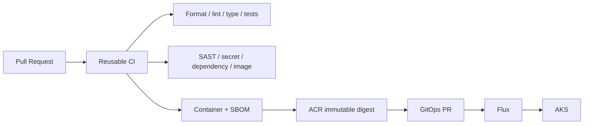

# CI/CD Architecture

Status: **Approved design; not implemented**

Rules:

- Caller workflows stay thin and pin a reviewed reusable-workflow release.
- Trusted GitHub Actions use OIDC, not long-lived Azure client secrets.
- Images are built once and promoted by digest through dev, staging, and portfolio-prod.
- GitHub Actions never runs production `kubectl apply`; Flux is deployment authority.
- Rollback is a Git revert to the previous known-good digest.
