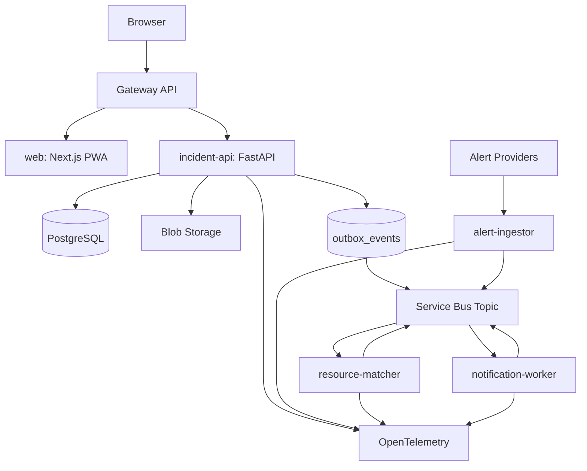

# Container Architecture

Status: **Approved design; not implemented**

Service boundary rules:

- `incident-api` owns incidents, requests, lifecycle, centers/resources, assignments, audit records, and the outbox publisher.
- `alert-ingestor` owns provider adapters, normalization, attribution, and alert publication.
- `resource-matcher` owns deterministic match proposals, not final assignment authority.
- `notification-worker` owns delivery adapters and outcomes.
- No separate audit, authentication, reporting, profile, attachment, scheduling, or analytics service is planned.
