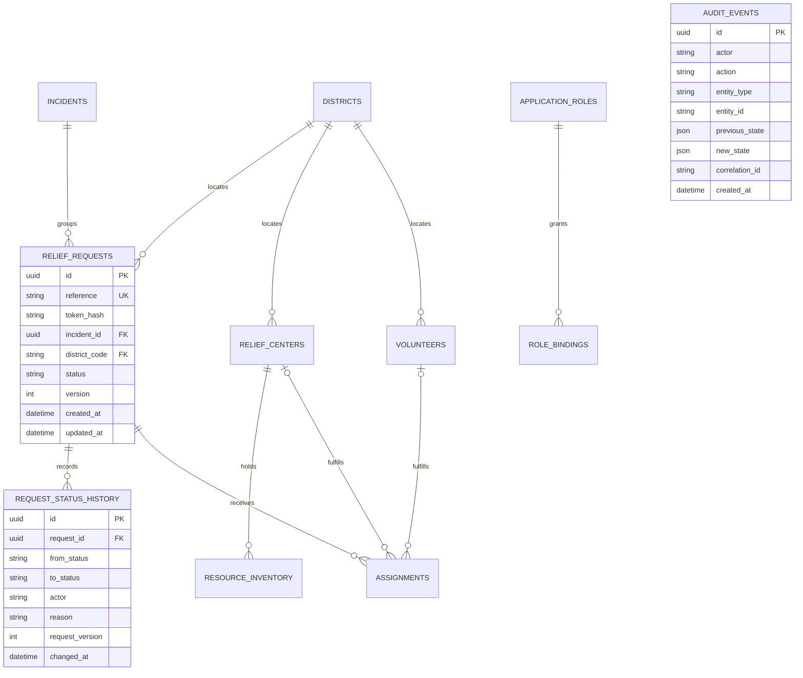

# Phase 2 Operational Data Model

Status: **Implemented**



## Ownership and transactions

The Incident API owns every table in this diagram. Creating a request commits the request, initial history entry, and audit event together. A lifecycle update uses an expected version and commits the state, history, and audit event in one transaction. Assigning a request commits the assignment, `ASSIGNED` transition, history, and audit together.

## Lifecycle

```text
SUBMITTED -> TRIAGED -> VERIFIED -> ASSIGNED -> IN_PROGRESS -> COMPLETED
     |          |          |           |              |
     +----------+----------+-----------+--------------+-> CANCELLED
                +----------+-> REJECTED
```

Completed, rejected, and cancelled requests are terminal. Rejection and cancellation require a reason.

## Index intent

- `reference` is unique for citizen lookup.
- `(status, priority, created_at)` supports the operational queue.
- `(district_code, status)` supports district coordination.
- `(request_id, changed_at)` supports ordered history.
- center/resource, volunteer availability, assignment, role binding, and audit lookup indexes match their compact Phase 2 endpoints.

