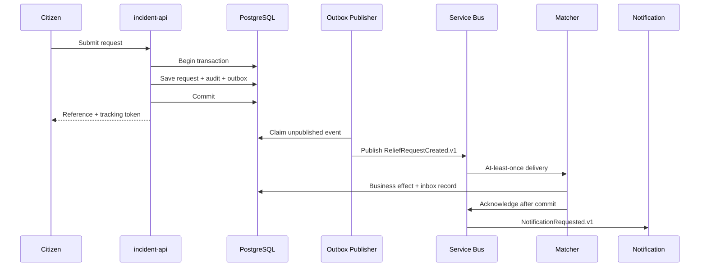

# Event and Reliability Flow

Status: **Approved design; not implemented**

Guarantees:

- A committed request cannot silently lose its intended event because request/outbox share a transaction.
- Consumers use `processed_messages(event_id, consumer_name, processed_at)` and acknowledge after their database transaction.
- The platform claims effectively-once business processing over at-least-once messaging, never exactly-once delivery.
- Event contracts use small versioned JSON Schemas and automated compatibility tests; no schema registry is planned.
