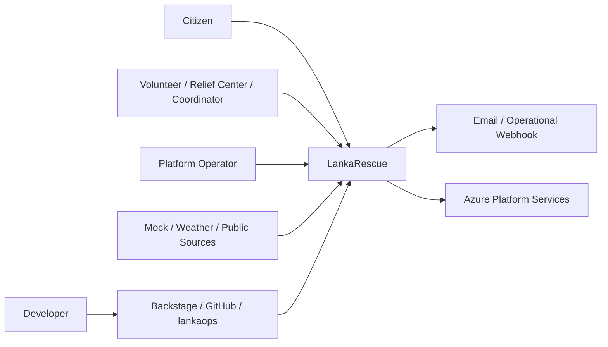

# System Context

Status: **Approved design; not implemented**

LankaRescue accepts relief requests, supports staff verification/assignment, ingests non-authoritative alert information, proposes resource matches, produces notifications, and records auditable actions. It is an educational portfolio workload, not an official emergency service.

Trust assumptions:

- External provider data is untrusted, attributed, time stamped, and non-critical to platform availability.
- Citizens do not require accounts; secure tracking tokens protect lookup.
- Staff authenticate through Microsoft Entra and receive explicit application roles.
- Portfolio environments contain synthetic data only.
