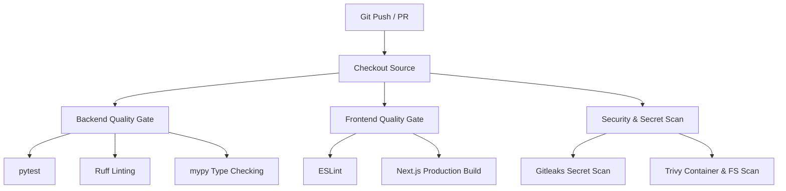

# CI/CD & Security Pipeline

**Goal**: Automate testing, quality gates, and security scanning on every push to `main` and all Pull Requests.

Our DevOps delivery pipeline does not just build code—it strictly enforces code quality and security standards before any image can be released.

## Pipeline Architecture

## Security Posture

We utilize two primary tools for our automated security gating:
1. **Gitleaks**: Blocks any hardcoded credentials, API keys, or database passwords from entering the codebase.
2. **Trivy**: Performs deep vulnerability scanning on the repository filesystem to detect vulnerable dependencies before they reach production.

*Implementation path: `.github/workflows/ci.yaml`*
